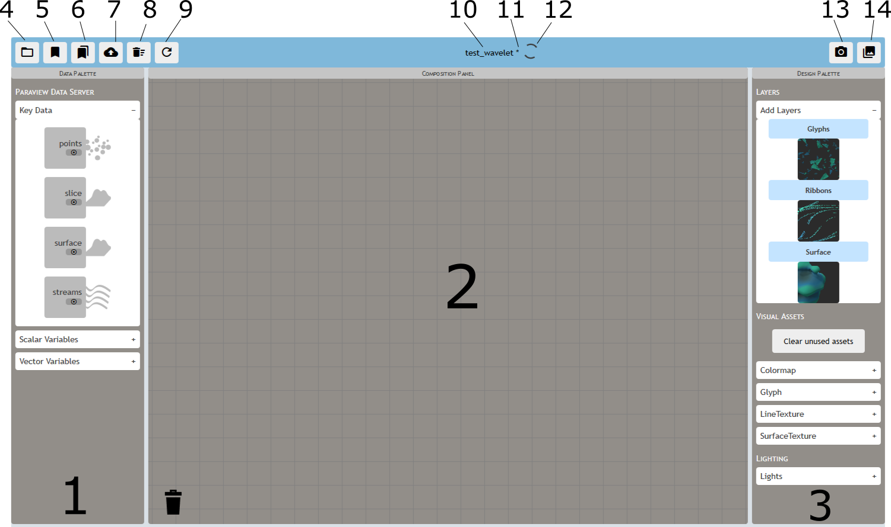
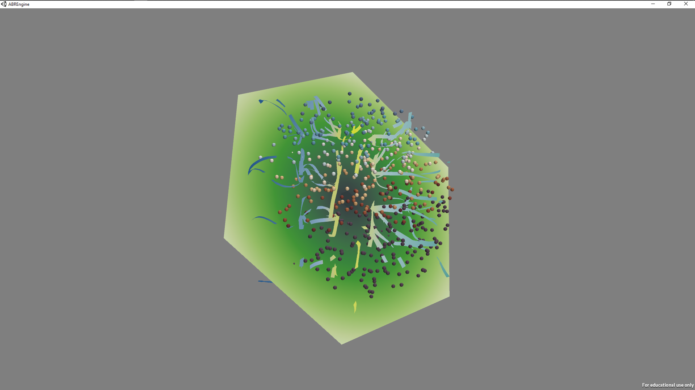
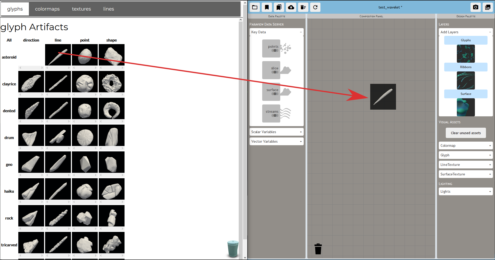
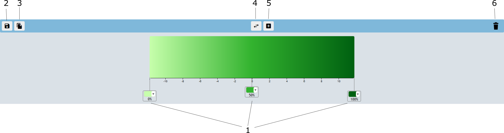
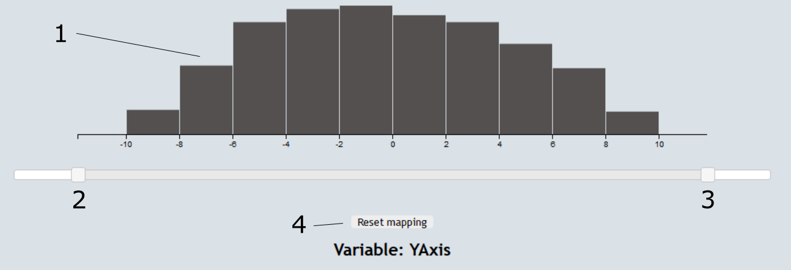

# User Interface Overview

## Composition workspace
The composition workspace is where you'll be creating visualizations. There
are several important parts:

1. Data palette - key data, scalar variables, vector variables
2. Composition panel - create the visualization
3. Design palette - layers, visual assets, lighting
4. Load
5. Save
6. Save as
7. Upload
8. Clear
9. Refresh
10. Current state name
11. Unsaved work indicator
12. Loading indicator
13. Take a screenshot
14. Download screenshots

## ABR Engine
If you're creating visualizations locally, you'll view them in the ABR
Engine. The camera can be moved with the following controls:

- **Orbit:** Left click
- **Pan:** Shift + left click
- **Zoom:** Right click

## Loading visual assets from the SculptingVis library
ABR is designed to work with the [SculptingVis
library](https://sculpting-vis.tacc.utexas.edu/library). Visual assets
(glyphs, colormaps, lines, and textures) can be drag and dropped from the
library (1) into anywhere in the composition panel (2) and they will be
downloaded into your local palette for use in ABR.

## Colormap editor and data remapper

### Colormap editor
The colormap editor allows you to change colormaps, copy them, and see the
colormap in relation to the data histogram.

1. Color stops (edit a color, or drag them to the trash)
2. Save colormap (update the colormap within the ABR engine)
3. Copy colormap (create a copy of this colormap in the palette)
4. Flip colormap
5. Add a new color stop
6. Trash can

### Data remapper
Sometimes the provided minimum and maximum of a particular variable in a
dataset are not sufficient. In this case, you may want to *remap* your data
by changing its minimum and maximum values. The histogram of the variable is provided (1), along with handles to change the minimum (2) and maximum (3), along with a button to reset back to the original extrema of the variable (4).

