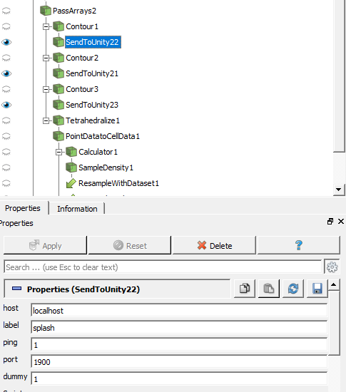

# Loading data from ParaView
ABR relies on ParaView to do data processing. In order to get the data from
ParaView into Unity, the SendToUnity2 plugin (provided in ABRUtilities) must
be used.

## The SendToUnity2 plugin
**Note:** The ABR Engine must be running before you use this plugin (or load a
ParaView state that uses this plugin)!

The SendToUnity2 plugin has several options that can be set:

- **Host:** The IP address of the ABR Engine to send the data to (leave at `localhost` if ParaView and Engine are running on the same computer)

- **Label:** The label that the data should have in ABR. It's not a bad idea to prefix it with a short unique name of the dataset you're currently working with.

- **Ping:** Should be left at 1.

- **Port:** Should be left at 1900.

- **Dummy:** If you want to resend the data to Unity (call it "twiddling the data"), change this field.

