# Designing your first visualization with ABR

## Part 1: Basic usage
### Importing visual assets
To import visual assets into ABR, one needs only drag and drop them from the
[SculptingVis Library](https://sculpting-vis.tacc.utexas.edu/library). The
assets will automatically download for you to use in your visualizations.

### Creating a layer
In ABR, visualizations are organized into layers. Right now, there are three layer types: Glyphs, Ribbons, and Surfaces. You can create a new layer by dragging it from the "Add Layers" dropdown of the design palette into the composition panel.

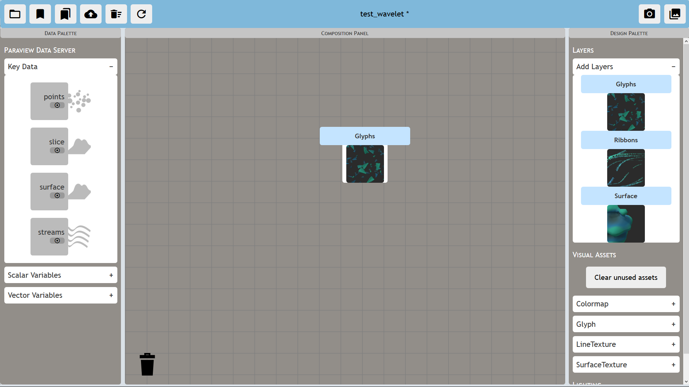

### Action buttons
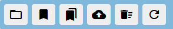

- **Load a state:** Use the Load button in the upper left corner to load a
state. You will be presented with a grid of states that are available to ABR;
click its picture to load the state. Additionally, you can save the state
locally or delete it with the buttons below each preview picture.

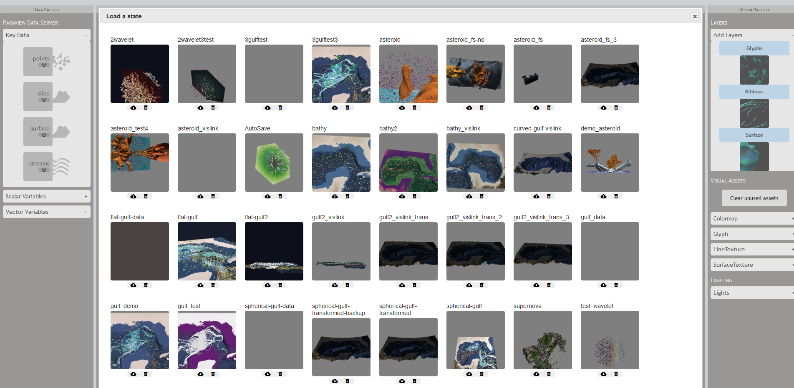

- **Save a state:** Use the Save button in the upper left to save over the
current state.

- **Save as:** Use the Save As button to save a new state.

- **Upload a state:** Upload a state into the engine. Useful if someone else has shared a state with you.

- **Clear the state:** If you want to start over, click the clear state button.

- **Refresh the state:** Use this button if you're experiencing problems. **WARNING:** save your state first!

### Loading a state

### Assigning puzzle pieces
There are several types of "puzzle pieces" in the ABR interface. Some represent key data, some represent variables, while others stand in place of visual assets. See the following table for which is which:

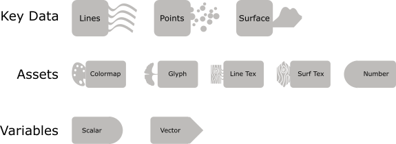

#### Assigning key data
ABR data are organized into three categories - Points, Lines, and Surfaces.
These correspond directly to the Glyph, Ribbon, and Surface layers. Once you
have created a layer, you can drag data from the "Key Data" dropdown in the
data palette. Make sure the puzzle piece connectors match.

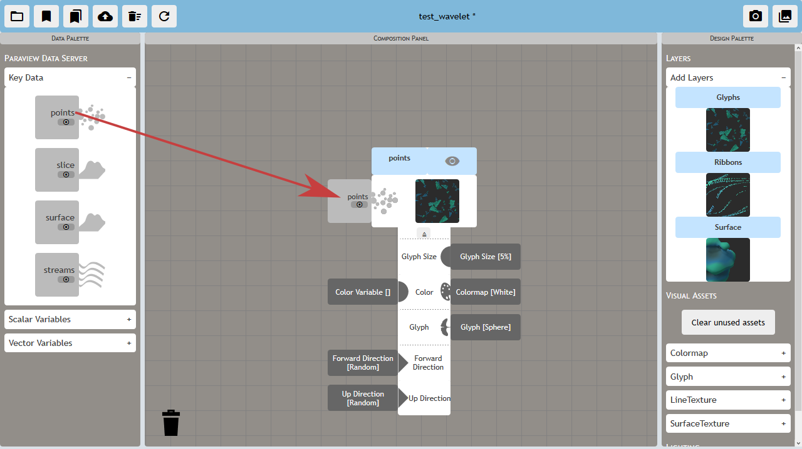

### Assigning variables
ABR supports both scalar and vector variables. These can be found under the corresponding dropdowns in the data palette. To filter the available variables for the piece of key data you're interested in, press the solo supported variables button (small target-looking icon) on that key data.

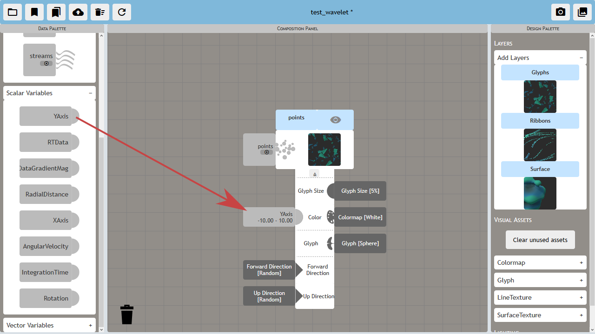

### Assigning visual assets
ABR supports four types of visual assets: colormaps, glyphs, lines, and textures. They can be found under the corresponding dropdowns in the design palette.

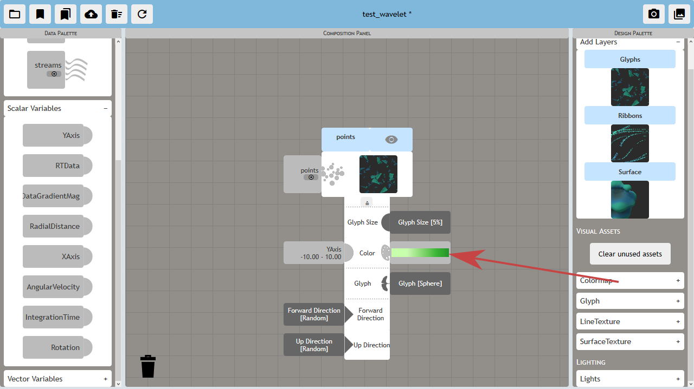

### Deleting a layer
Layers can be deleted by dragging them to the trash can.

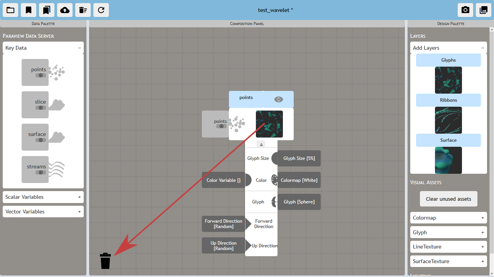

## Part 2: Advanced usage
### Taking a snapshot

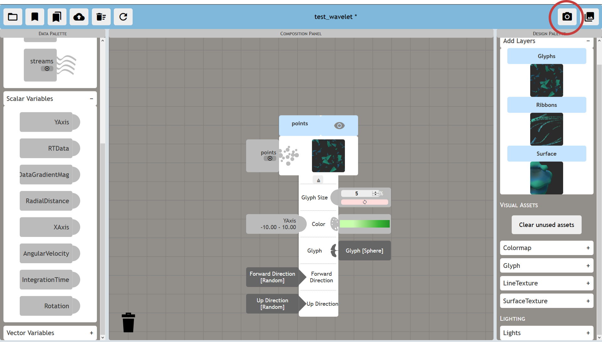

Snapshots of your current state can be obtained by clicking the camera icon in the upper right of the compose interface.

### Changing numeric parameters on a layer
Some parameters that layers have are represented by a numeric value. To assign a numeric value to these inputs, click the parameter, then change the value and press "Enter" or click the sync button on the numeric puzzle piece.

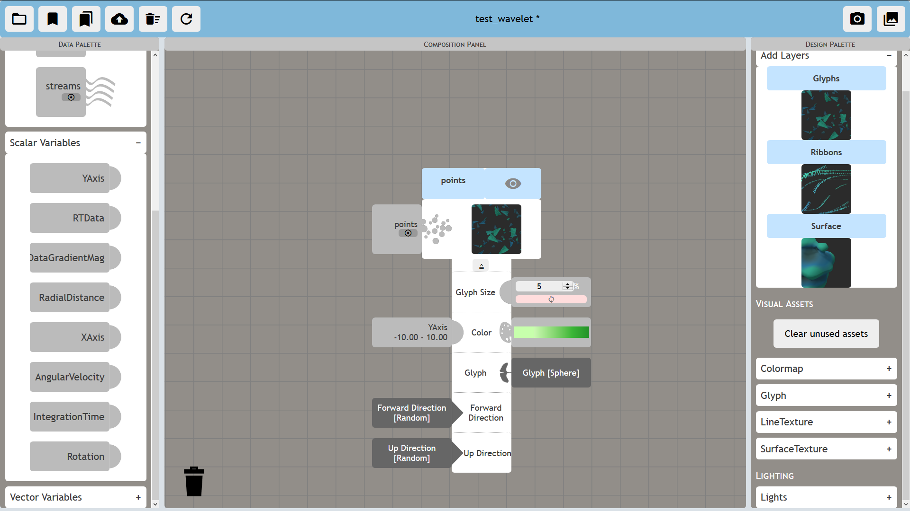

### Editing a colormap
While the SculptingVis library does provide some excellent colormaps, they are provided as a starting point, and we recognize that creating custom colormaps for a particular dataset is essential. We've provided this functionality with the colormap editor. You can flip a colormap, create and delete color stops within the colormap, and change the color of each stop. One thing to note: the edited colormaps will *only exist within the state you save, the will not be uploaded to the library!*. Additionally, be careful when editing a color map. If you use the edited colormap multiple times, it will change across **all of your states**!

### Remapping a scalar variable
The scalar variable remapper allows you to change the extrema of a particular
variable. This is useful if the data only lies within a small range but ABR
has given you a large range. You can use the histogram to infer where the
most frequent values are for the variable shown. When you move the handles on
the slider at the bottom of the histogram, the ranges will automatically be
updated within ABR.

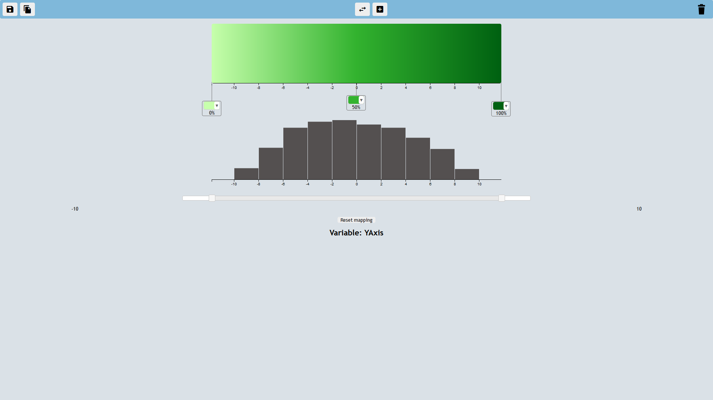

### Lighting
If needed, you can change the lighting paramters within the scene. There are two directional lights whose directions and intensities can be changed using the lighting dropdown.

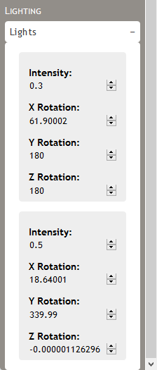